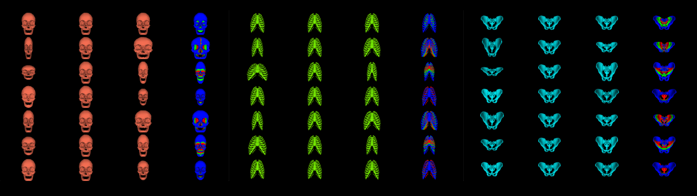
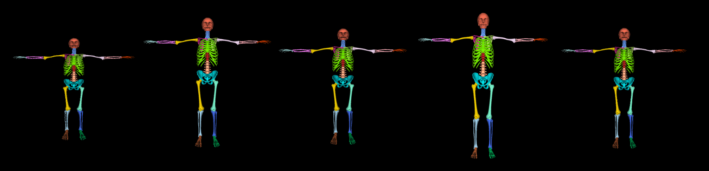

# gloss_skeleton
GLoSS Model of the Human Skeleton

This repostory contains code for using a [Stitched Puppet](http://stitch.is.tue.mpg.de/) model of the human skeleton with global-local optimization (GLoSS).
The skeleton GLoSS model has been created for the work "OSSO: Obtaining Skeletal Shape form Outside" (CVPR2022), and has been created from a skeleton template from ["Anatomy Transfer"](https://www.cs.utah.edu/~ladislav/alihamadi13anatomy/alihamadi13anatomy.html)
The Stitched Puppet model has been defined in the work ["The Stitched Puppet: A Graphical Model of 3D Human Shape and Pose"](https://files.is.tue.mpg.de/black/papers/StitchCVPR2015.pdf) (CVPR2015). In this work, inference is performed with Non-Parametric Belief Propagation, with a novel mode-preserving method introduced in ["Preserving Modes and Messages via Diverse Particle Selection"](https://files.is.tue.mpg.de/black/papers/ICML2014.pdf) (ICML2014).
In the work ["3D Menagerie: Modeling the 3D Shape and Pose of Animals"](https://files.is.tue.mpg.de/black/papers/smal_cvpr_2017.pdf) (CVPR2017) we defined a part-based model like SP, but with a different representation, based on the chumpy framework, for global optimization. We call this model GLoSS.

The image below shows the GLoSS local shape spaces for three skeleton parts.



## Installation
The code requires the following packages:  
chumpy,  
mesh library (https://github.com/MPI-IS/mesh). 

## Demo
To visualize samples from the model, run:
```
python show_skeleton.py
```



## Citation

If you found any of the pieces of code useful, please cite the following papers:

```
@inproceedings{Keller:CVPR:2022,  
  title = {OSSO: Obtaining Skeletal Shape form Outside},  
  author = {Keller, Marylin and Zuffi, Silvia and Black, Michael J. and Pujades, Sergi},  
  booktitle = {IEEE Conference on Computer Vision and Pattern Recognition (CVPR)},  
  pages = {},  
  publisher = {IEEE Computer Society},  
  year = {2022},  
}

@inproceedings{Zuffi:CVPR:2017,  
  title = {{3D} Menagerie: Modeling the {3D} Shape and Pose of Animals},  
  author = {Zuffi, Silvia and Kanazawa, Angjoo and Jacobs, David and Black, Michael J.},  
  booktitle = {IEEE Conference on Computer Vision and Pattern Recognition (CVPR)},  
  pages = {5524--5532},  
  publisher = {IEEE Computer Society},  
  year = {2017},  
}

@inproceedings{Zuffi:CVPR:2015,
  title = {The Stitched Puppet: A Graphical Model of {3D} Human Shape and Pose},
  author = {Zuffi, Silvia and Black, Michael J.},
  booktitle = { IEEE Conf. on Computer Vision and Pattern Recognition (CVPR 2015)},
  pages = {3537--3546},
  month = jun,
  year = {2015},
  doi = {10.1109/CVPR.2015.7298976},
  month_numeric = {6}
}
```
